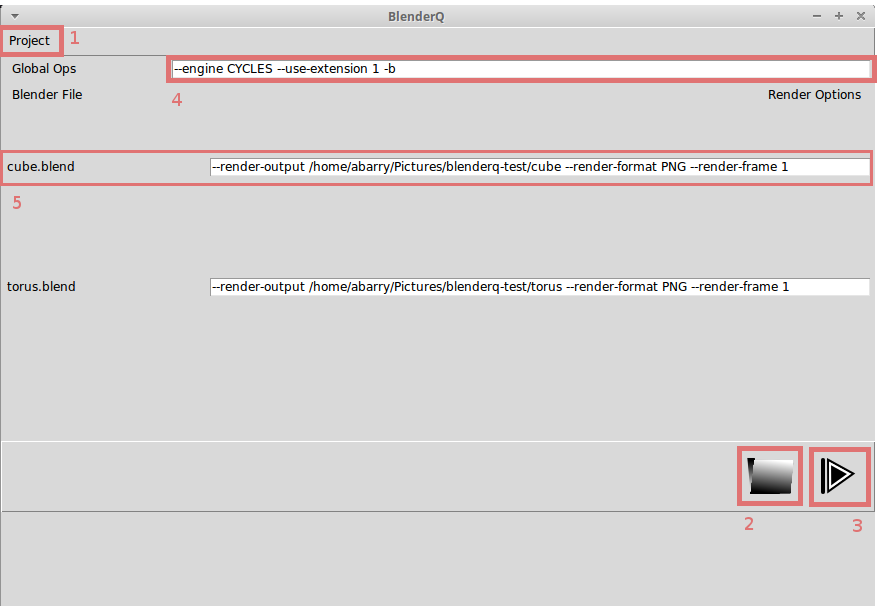

.. _use:

Using BlenderQ
==============

:ref:`Go Home <index>`

The UI
------

The BlenderQ UI centers around the File List, which displays all the files to be rendered.

For each file in the file list, BlenderQ will call blender and pass in the file specified.
It will also pass command line arguments, which can be defined globally or per-file.

1. Project Menu - Contains options for managing your project.  These include:

   a. New - Create a new Project (resets the UI and removes all files)
   b. Load - Load a Project File (stored in JSON)
   c. Save - Save the current state of the application as a Project File
   d. Exit - Exit the application

2. Find Blender Files - Opens a file dialogue which lets the user choose the .blend files to render
3. Run Runders - Executes renders for all of the files currently in the list
4. Global Ops - Global command line arguments for Blender
5. File List Entry - Line in the File List, in which we can specify command line arguments specific to each file.

How to Use It
-------------

The basic workflow for BlenderQ is:

1. Use the 'Find Blender Files' button to pull as many files as desired into the file list.  We can do this multiple times to load files from different folders into the same BlenderQ project.
2. If desired, update the command line arguments
3. Hit the 'Run Renders' button, and go get a coffee
4. Labels in the file list will turn green for successful renders, and red if any errors are reported

When you're done, you can save your BlenderQ project to a json file with the 'Save' option in the Project Menu.  Then,
if you want to re-run the renders, you've still got them ready to go.

Command Line Arguments
----------------------

The config.ini file offers two different options to reduce time spent updating command line arguments:

1. blender.hidden_ops - The default global command line arguments
2. blender.default_ops - The default individual command line arguments

Either of these can be updated in the config.ini file.  Then, restart BlenderQ and the new values will become the defaults.

For more information on Blender command line arguments, please see https://docs.blender.org/manual/en/dev/render/workflows/command_line.html
